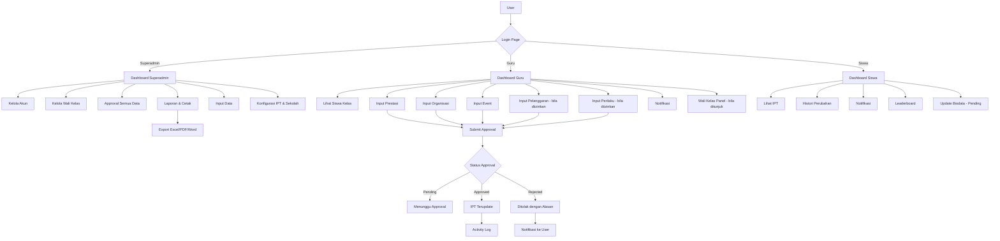
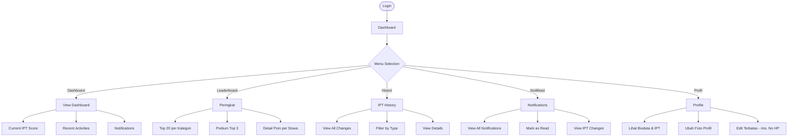
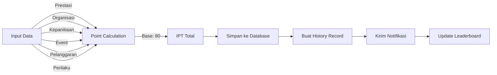
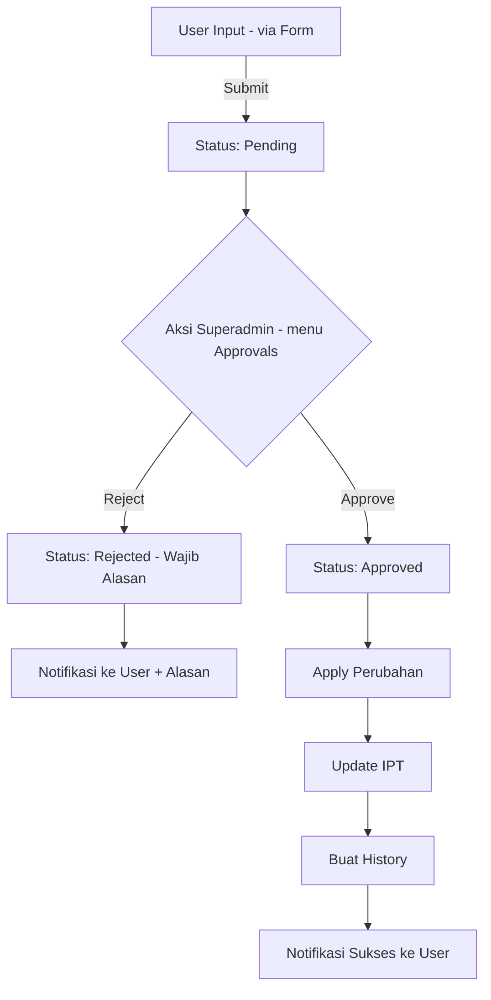

# 📚 Mandara Talenta - Dokumentasi Lengkap

## 📋 System Requirements

### Backend Requirements
```
Node.js >= 16.x
PostgreSQL >= 14
npm >= 8.x
```

### Frontend Requirements
```
Node.js >= 16.x
npm >= 8.x
Browser: Chrome/Firefox/Safari/Edge (latest)
```

### Hardware Requirements
```
Minimum:
- RAM: 4GB
- Storage: 10GB
- CPU: 2 cores

Recommended:
- RAM: 8GB+
- Storage: 50GB+
- CPU: 4 cores+
```

---

## 📦 Installation Guide

### 1. Backend Installation

```bash
# Navigate to backend folder
cd backend

# Install dependencies
npm install

# Create .env file from example
copy .env.example .env

# Edit .env with your configuration
# - Database credentials
# - JWT Secret
# - Allowed origins

# Start server
npm start

# Or development mode
npm run dev
```

### 2. Frontend Installation

```bash
# Navigate to frontend folder
cd frontend

# Install dependencies
npm install

# Start development server
npm start

# Build for production
npm run build
```

### 3. Database Setup (PostgreSQL)

Cara otomatis (disarankan):
```bash
cd backend
npm install
npm run db:setup   # membuat database ipt_school + mengimpor skema
```

Cara manual:
```bash
# 1. Install PostgreSQL 14+ dari https://www.postgresql.org/download/
#    (installer Windows EDB sudah termasuk pgAdmin 4)

# 2. Buat database
createdb -U postgres ipt_school
# (atau via pgAdmin: klik kanan Databases -> Create -> ipt_school)

# 3. Impor skema (semua tabel + data awal)
psql -U postgres -d ipt_school -f backend/database/skema.sql

# 4. Verifikasi
psql -U postgres -d ipt_school -c "\dt"
```

Pastikan `backend/.env` berisi kredensial PostgreSQL yang benar (lihat `backend/.env.example`):
```env
DB_HOST=localhost
DB_USER=postgres
DB_PASSWORD=password_postgres_anda
DB_PORT=5432
DB_NAME=ipt_school
JWT_SECRET=string_acak_minimal_32_karakter
SUPERADMIN_SETUP_PASSWORD=password_awal_rahasia
```

---

## 🔐 Default Accounts

| Role | Username | Password |
|------|----------|----------|
| Superadmin | ADMIN001 | Nilai `SUPERADMIN_SETUP_PASSWORD` **(hanya login pertama)** |
| Guru | (NIP guru) | (dibuat superadmin) |
| Siswa | (NIS) | (dibuat superadmin) |

> **Login pertama:** database baru berisi ADMIN001 dengan password placeholder.
> Isi `SUPERADMIN_SETUP_PASSWORD` di `.env`, login dengan username `ADMIN001` dan
> password tersebut - password otomatis di-hash saat login. Segera ganti password
> lewat menu Profile, lalu hapus variabel itu dari `.env`. Tidak ada login
> `ADMIN001/admin123` sebelum langkah ini dilakukan.

---

## 📊 System Architecture

### Flowchart: Overall System Flow



---

## 👤 Role-Based Flowcharts

### 1. Superadmin Flow

```mermaid
flowchart TD
    Start([Login]) --> Dashboard
    Dashboard --> Menu{Menu Selection}
    
    Menu -->|Kelola Akun| KA[Kelola Akun]
    KA --> KA1[Create Guru/Siswa]
    KA --> KA2[Edit Account]
    KA --> KA3[Delete Account]
    KA --> KA4[Manage Permissions]
    
    Menu -->|Wali Kelas| WK[Wali Kelas]
    WK --> WK1[Assign Wali Kelas]
    WK --> WK2[View Class Stats]
    WK --> WK3[Remove Assignment]
    
    Menu -->|Approvals| AP[Approvals V2]
    AP --> AP1[View Pending]
    AP --> AP2[Approve/Reject]
    AP --> AP3[View History]
    AP --> AP4[Bulk Actions]
    
    Menu -->|Input Access| IA[Input Access Control]
    IA --> IA1[Enable/Disable Input]
    IA --> IA2[Role-based Access]
    IA --> IA3[Individual Permissions]
    
    Menu -->|Laporan| LP[Laporan & Cetak]
    LP --> LP1[Filter by Class]
    LP --> LP2[Export Excel]
    LP --> LP3[Export PDF]
    LP --> LP4[Export Word]
    
    Menu -->|Logs| LG[Activity Logs]
    LG --> LG1[View All Activities]
    LG --> LG2[Filter by User/Date]
    LG --> LG3[Export Logs]
    
    Menu -->|Profile| PR[Profile]
    PR --> PR1[View Profile]
    PR --> PR2[Update Avatar]
    PR --> PR3[Change Password]
    
    Menu -->|File Manager| DR[File Manager - Penyimpanan Lokal]
    DR --> DR1[Lihat File Bukti]
    DR --> DR2[Kelola Upload Server]
    DR --> DR3[Lihat Foto Profil]
```



### 2. Guru (Teacher) Flow

```mermaid
flowchart TD
    Start([Login]) --> Dashboard
    Dashboard --> Menu{Menu Selection}
    
    Menu -->|Input Prestasi| IP[Input Prestasi]
    IP --> IP1[Select Siswa]
    IP --> IP2[Fill Prestasi Form]
    IP --> IP3[Upload Bukti]
    IP --> IP4[Submit for Approval]
    
    Menu -->|Input Organisasi| IO[Input Organisasi]
    IO --> IO1[Select Siswa]
    IO --> IO2[Fill Organisasi Form]
    IO --> IO3[Upload Bukti]
    IO --> IO4[Submit for Approval]
    
    Menu -->|Input Kepanitiaan| IK[Input Kepanitiaan]
    IK --> IK1[Select Siswa]
    IK --> IK2[Fill Kepanitiaan Form]
    IK --> IK3[Upload Bukti]
    IK --> IK4[Submit for Approval]
    
    Menu -->|Input Event| IE[Input Event]
    IE --> IE1[Select Siswa]
    IE --> IE2[Fill Event Form]
    IE --> IE3[Upload Bukti]
    IE --> IE4[Submit for Approval]
    
    Menu -->|Input Pelanggaran| IPL[Input Pelanggaran]
    IPL --> IPL1[Select Siswa]
    IPL --> IPL2[Fill Pelanggaran Form]
    IPL --> IPL3[Point Reduction]
    IPL --> IPL4[Submit for Approval - perlu izin superadmin]
    
    Menu -->|Input Perilaku| IPR[Input Perilaku]
    IPR --> IPR1[Select Siswa]
    IPR --> IPR2[Fill Perilaku Form]
    IPR --> IPR3[Point Addition]
    IPR --> IPR4[Submit for Approval - perlu izin superadmin]
    
    Menu -->|Notifikasi| NT[Notifikasi]
    NT --> NT1[Lihat Status Pengajuan]
    NT --> NT2[Tandai Dibaca]
    
    Menu -->|Wali Kelas| WK[Teacher Wali Kelas]
    WK --> WK1[View My Class]
    WK --> WK2[View Class Statistics]
    WK --> WK3[View Siswa Details]
    WK --> WK4[Print Class Report]
    
    Menu -->|Laporan| LP[Laporan Cetak]
    LP --> LP1[View Reports]
    LP --> LP2[Export Data]
    
    Menu -->|Profile| PR[Profile]
    PR --> PR1[View/Edit Profile]
    PR --> PR2[Update Avatar]
```



### 3. Siswa (Student) Flow



---

## 🔄 Data Flow Diagrams

### IPT Calculation Flow



> Catatan: tidak ada batas 0–100 - nilai IPT boleh negatif
> (lihat `backend/utils/ipt.js`). Batas minimum IPT per tingkat
> diatur di menu Konfigurasi IPT.


### Approval Workflow



> Catatan: input langsung oleh superadmin otomatis approved tanpa antrean.
> Guru/Siswa wajib menunggu persetujuan superadmin.


---

## 📁 File Structure

```
mandara-talenta/
├── backend/
│   ├── config/
│   │   └── database.js
│   ├── middleware/
│   │   ├── auth.js          # JWT, RBAC, cek izin input
│   │   └── security.js      # rate limit, helmet, anti-SQLi
│   ├── routes/              # dipasang di server.js sebagai /api/*
│   │   ├── auth.js            → /api/auth
│   │   ├── users.js           → /api/users
│   │   ├── prestasi|organisasi|kepanitiaan|event|pelanggaran|perilaku.js
│   │   ├── approvals.js       → /api/approvals (sistem approval aktif)
│   │   ├── permissions.js + input-access.js
│   │   ├── logs.js            → /api/logs
│   │   ├── dashboard.js       → /api/dashboard/stats
│   │   ├── waliKelas.js       → /api/wali-kelas
│   │   ├── search.js          → /api/search (+ leaderboard)
│   │   ├── profile.js         → /api/profile
│   │   ├── reports.js         → /api/reports
│   │   ├── file-viewer.js, academicYear.js, sync.js
│   │   └── iptConfig.js       → /api/ipt-config
│   │       school-config.js    → /api/school-config
│   ├── utils/               # ipt.js, iptConfig.js, schoolConfig.js, ...
│   ├── scripts/
│   │   └── setupDb.js         # npm run db:setup
│   ├── database/
│   │   └── skema.sql
│   ├── uploads/             # prestasi|organisasi|kepanitiaan|event|
│   │                         # pelanggaran|perilaku|approvals|approved|avatars|logos
│   ├── .env                 # dari .env.example (jangan di-commit)
│   ├── .env.example
│   ├── server.js
│   └── package.json
├── frontend/
│   ├── public/
│   ├── src/
│   │   ├── components/
│   │   │   ├── Login.js + Navbar.js + App.js routing
│   │   │   ├── Dashboard.js + Dashboard.css
│   │   │   ├── InputPrestasi|Organisasi|Kepanitiaan|Event|Pelanggaran|Perilaku.js
│   │   │   ├── KelolaAkun.js + IzinAkun.js
│   │   │   ├── Approvals.js
│   │   │   ├── Leaderboard.js + WaliKelas.js + TeacherWaliKelas.js
│   │   │   ├── KonfigurasiIPT.js + SchoolConfig.js
│   │   │   ├── LaporanCetak.js + IptReport.js + IptPrintSheet.js
│   │   │   ├── Profile.js + StudentDetail.js + StudentRecordsHistory.js
│   │   │   ├── Search.js + Notifications.js + NotificationBadge.js
│   │   │   ├── Logs.js + DriveViewer.js + EditModal.js
│   │   │   └── icons.js (sistem ikon lucide bersama)
│   │   ├── utils/ (api.js, minIpt.js, kelasJurusan.js, ...)
│   │   ├── hooks/, config.js, index.js, index.css
│   ├── package.json
│   └── .env (bila perlu override API)
├── docs/
│   └── ACADEMIC_YEAR_SYSTEM.md
├── DOCUMENTATION.md / REQUIREMENTS.md / QUICK_GUIDE.md
├── SECURITY.md / IPT_SYNC_GUIDE.md / DOCS_INDEX.txt
├── FLOWCHART.html (+ versi sederhana)
├── LICENSE (proprietary) + README.md
```

---

## 🔧 Dependencies List

### Backend Dependencies
| Package | Version | Purpose |
|---------|---------|---------|
| express | ^4.18.2 | Web framework |
| pg | ^8.11.3 | PostgreSQL driver (node-postgres) |
| bcryptjs | ^2.4.3 | Password hashing |
| jsonwebtoken | ^9.0.2 | JWT authentication |
| cors | ^2.8.5 | Cross-origin requests |
| dotenv | ^16.3.1 | Environment variables |
| multer | ^1.4.5 | File upload handling |
| express-validator | ^7.0.1 | Input validation |
| helmet | ^7.1.0 | Security headers |
| express-rate-limit | ^7.1.5 | Rate limiting |

### Frontend Dependencies
| Package | Version | Purpose |
|---------|---------|---------|
| react | ^18.2.0 | UI library |
| react-router-dom | ^6.20.1 | Routing |
| axios | ^1.6.2 | HTTP client |
| recharts | ^2.10.3 | Grafik dashboard |
| lucide-react | ^1.41.0 | Sistem ikon |
| react-select | ^5.10.2 | Dropdown kaya fitur |
| xlsx | ^0.18.5 | Excel export/import |
| exceljs | ^4.4.0 | Template Excel |
| jspdf | ^2.5.1 | PDF export |
| jspdf-autotable | ^3.8.1 | PDF tables |
| framer-motion | ^12.38.0 | Animasi |
| aos | ^2.3.4 | Animasi scroll |

---

## 🚀 Deployment Checklist

### Pre-Deployment
- [ ] Change JWT_SECRET to strong random string
- [ ] Update database credentials
- [ ] Set NODE_ENV=production
- [ ] Configure ALLOWED_ORIGINS
- [ ] Enable HTTPS
- [ ] Test all features
- [ ] Run security audit: `npm audit`
- [ ] Build frontend: `npm run build`

### Security
- [ ] Disable CORS wildcard in production
- [ ] Enable rate limiting
- [ ] Configure security headers
- [ ] Set up HTTPS certificates
- [ ] Enable firewall rules
- [ ] Regular backups configured

### Monitoring
- [ ] Activity logs enabled
- [ ] Error tracking setup
- [ ] Performance monitoring
- [ ] Database backups scheduled

---

## 📞 Support & Maintenance

### Regular Maintenance Tasks
1. **Daily**: Check activity logs for suspicious actions
2. **Weekly**: Review pending approvals
3. **Monthly**: Backup database
4. **Quarterly**: Update dependencies, rotate secrets

### Troubleshooting
| Issue | Solution |
|-------|----------|
| Login fails | Check JWT_SECRET, database connection |
| Avatar not loading | Check CORS headers, upload folder permissions |
| Export fails | Check xlsx/jspdf dependencies |
| Database error | Check PostgreSQL service, credentials in .env, run `npm run db:setup` |
| 404 errors | Check API routes, baseURL config |

---

**Document Version**: 2.0
**Last Updated**: September 27, 2026
**System Version**: Mandara Talenta v0.2
